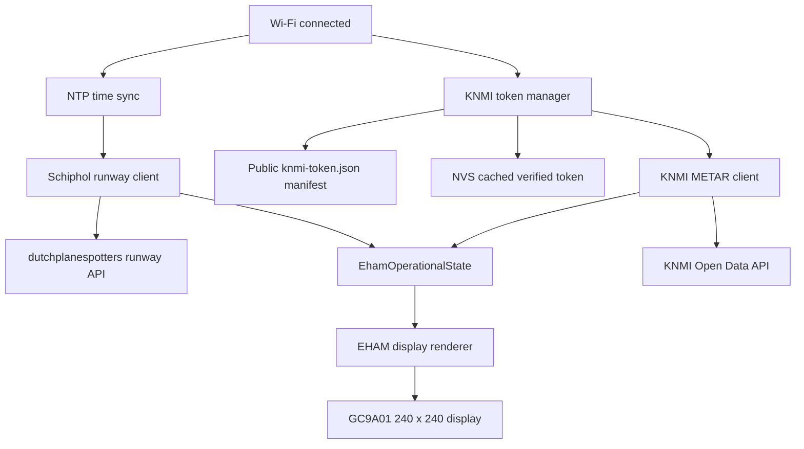

# ESP32 Schiphol Runways-in-Use Display

## Implementation plan for a milestone-based rebuild of ESP32-Plane-Radar

**Target hardware:** ESP32-C3 Super Mini with a 1.28 inch 240 x 240 GC9A01 round display  
**Starting codebase:** `MatixYo/ESP32-Plane-Radar`  
**Primary airport:** Amsterdam Airport Schiphol, EHAM  
**Primary function:** Display the current landing and departure runways at Schiphol  
**Optional secondary function:** Display a compact official EHAM METAR weather summary when KNMI data is available  
**Document date:** 2026-07-21

---

## Handover

> **To the next agent:** this section is scratch space for milestone-to-milestone
> handoff, not part of the plan. Replace it entirely with your own handover
> before you stop — don't append. Keep it short: status, what's next, and any
> non-obvious lessons the plan doesn't already cover.

**Status (2026-07-21):** Milestones 1, 2, and 3 are done. Milestone 3 is on
branch `milestone-3-implementation`, not yet merged/PR'd against `main`.
`main.cpp` still renders the static EHAM runway screen (all-inactive state,
or fixture-cycling under `EHAM_ENABLE_FIXTURES`); the old radar/ADS-B source
files are untouched and still compile, just unused from `main()`.

**Milestone 3 changes:** renamed AP/hostname to `SchipholRunways-Setup` /
`schiphol-runways` (superseding Milestone 2's interim `EhamRunways-Setup` /
`eham-runways`). Removed the Latitude/Longitude/miles/runway-overlay
WiFiManager portal fields and their save/reset plumbing from
`wifi_setup.cpp` (the portal now only has Wi‑Fi credentials). Dropped the
now-unnecessary `services::location::init()` / `ui::radar::rangeInit()`
calls from `main.cpp` — those services/headers still exist untouched (M10
deletes them), just no longer referenced. BOOT short tap in normal
(non-fixture) builds now logs a force-refresh event to serial instead of
doing nothing (actual refresh logic lands in Milestone 5). Status screens
(`status_screens.cpp`) are rebranded to the Schiphol palette via
`ui::schiphol` colors instead of the old black/yellow scheme; `main.cpp`
calls `ui::schiphol::initPalette()` right after `displayInit()` so those
colors are ready before any status screen draws (the EHAM display code
already called `initPalette()` itself for its own draws). README updated to
match.

**Next up: Milestone 4** (NTP and robust timestamp parsing).

**Lessons learned from Milestone 3:**

- `wifi_setup.cpp` no longer needs `services/radar_location.h` or
  `ui/radar_range.h` at all — those were only pulled in for the portal
  fields removed this milestone.

**Lessons learned:**

- **PlatformIO wasn't preinstalled** in this environment but `pip`/`pipx`
  were available — `pipx install platformio` works and gives a real build
  check (`pio run -e supermini`, `pio run -e supermini_eham_selftest`) instead
  of relying on manual code review. Do this early in any milestone; don't
  assume you have to review-only.
- **GCC 8.4 (this project's ESP32-C3 toolchain) rejects brace-return
  aggregate init on a struct with default member initializers** (e.g.
  `struct Vec2 { float x = 0.0f; float y = 0.0f; };` then `return {a, b};`
  fails to compile even under `-std=gnu++17`). Drop the default member
  initializers (plain aggregate, no in-class defaults) if you need this
  pattern — every call site should supply both fields anyway.
- **`main.cpp` still needs `services::location::init()` and
  `ui::radar::rangeInit()`** even though the EHAM screen itself doesn't use
  lat/lon or range presets — `src/services/wifi_setup.cpp` reads
  `ui::radar::useMiles()/showRunways()` and `services::location::lat()/lon()`
  directly to populate the WiFiManager portal fields. Don't strip these
  calls out of `main.cpp` until Milestone 3 actually removes those portal
  fields.
- **The GC9A01 panel needs a manual R/B swap in software** for colors drawn
  into an `LGFX_Sprite` — `cfg.rgb_order` in `lgfx_config.hpp` does not
  appear to affect sprite content, only direct panel writes (this was
  already discovered for the radar's aircraft-red marker in Milestone-era
  code; Milestone 2's `ui::schiphol::toPanelColor()` centralizes it for the
  new palette). This is unverified on real hardware for the *new* palette —
  no physical GC9A01 was available in this session. Run
  `ui::schiphol::paletteCalibrationDraw()` on the device before trusting the
  Schiphol colors, per Milestone 2's own acceptance intent.
- The user separately asked (mid-Milestone-2) to rename all remaining
  `plane-radar-*`/`PlaneRadar`/`planeradar` leftovers (CI artifact names,
  NVS namespace, partition/script filenames, README) to `eham-runways`. Kept
  as its own commit ahead of the milestone commit — worth doing as a
  separate pass like that again if similar rename debt surfaces, since it's
  unrelated to the milestone's acceptance criteria and easy to review in
  isolation.

---

## 1. Instructions to the coding agent

Implement this plan one milestone at a time. Every milestone must finish with:

1. A successful PlatformIO build for the `supermini` environment.
2. A device state that still boots and remains usable.
3. The acceptance checks for that milestone completed.
4. One focused commit using the suggested commit message.
5. No unfinished code from the following milestone.

Do not combine milestones. Do not remove old radar files until the replacement display and all live data paths work. Do not guess external API formats. Capture fixtures first, then implement parsers from those fixtures.

When an external response differs from this document:

1. Save a sanitized fixture of the actual response.
2. Update the documented contract.
3. Add a parser test case.
4. Only then change production code.

Never commit Wi-Fi credentials, Home Assistant credentials, private API keys, or device-specific secrets. The KNMI anonymous token is intentionally public, but it must live in the dedicated public configuration manifest rather than being manually entered into each board.

---

## 2. Product definition

The final device is not an aircraft radar. It is a dedicated Schiphol operations display.

The main screen must:

- Show a fixed schematic of all six EHAM runways.
- Highlight runways used for landings.
- Highlight runways used for departures.
- Show movement direction using arrows or chevrons.
- Highlight the active runway-end identifier, such as `18R`, `36C`, or `24`.
- Use the supplied Schiphol theme colors.
- Show official EHAM weather only when a complete, fresh KNMI METAR was retrieved successfully.
- Show no weather placeholder, warning, dashes, or stale weather when KNMI data is unavailable.
- Continue operating without Home Assistant.

### Final non-goals

Do not implement any of the following:

- ADS-B aircraft display.
- Radar range controls.
- User-configurable latitude or longitude.
- Miles or kilometres settings.
- Generic airport support.
- Global runway identifiers.
- Future runway predictions.
- Peak-time predictions.
- Home Assistant or MQTT integration in the first release.
- Scraping the KNMI developer web page from the ESP32.
- A user-entered KNMI token field in the setup portal.

Home Assistant can be considered later as an alternative data provider, but it must not be required by this implementation.

---

## 3. Existing code to retain and reuse

The starting project already provides useful infrastructure:

- ESP32-C3 Super Mini and GC9A01 hardware configuration.
- LovyanGFX display setup.
- A 240 x 240 frame sprite for flicker-free rendering.
- An embedded smooth font.
- WiFiManager captive portal setup.
- LAN configuration portal and mDNS.
- Wi-Fi reconnect handling.
- BOOT button short-tap and long-press handling.
- ArduinoJson.
- HTTPS requests through `HTTPClient` and `WiFiClientSecure`.
- PlatformIO build and merged release image generation.

Retain these parts initially. Replace only the radar-specific services and UI after their replacements work.

### Existing files expected to remain useful

```text
include/config.h
include/hardware/display.h
include/hardware/display_font.h
include/hardware/lgfx_config.hpp
include/services/wifi_setup.h
include/ui/status_screens.h
src/hardware/
src/services/wifi_setup.cpp
src/ui/status_screens.cpp
data/ui_font.vlw
scripts/merge-firmware.py
scripts/merge-firmware.sh
platformio.ini
partitions/plane_radar.csv
```

The partition filename may be renamed only in the final cleanup milestone.

---

## 4. Final architecture



### KNMI token manifest repo

1. **Public configuration repository**
   - Contains only the KNMI anonymous-token manifest, schema, validation script, and maintenance documentation.
   - Suggested name: `schiphol-display-config`.
   - Must contain no private data.

---

## 5. Target firmware structure

The exact filenames may be adjusted to match the repository conventions, but preserve these responsibilities.

```text
include/
  config.h
  data/
    eham_runways.h
  domain/
    eham_state.h
  services/
    clock_service.h
    runway_client.h
    runway_parser.h
    knmi_token_manager.h
    knmi_metar_client.h
    metar_parser.h
    wifi_setup.h
  ui/
    schiphol_theme.h
    eham_display.h
    status_screens.h

src/
  main.cpp
  data/
    eham_runways.cpp
  services/
    clock_service.cpp
    runway_client.cpp
    runway_parser.cpp
    knmi_token_manager.cpp
    knmi_metar_client.cpp
    metar_parser.cpp
    wifi_setup.cpp
  ui/
    schiphol_theme.cpp
    eham_display.cpp
    status_screens.cpp

tools/
  capture_runway_fixture.py
  inspect_knmi_metar.py
  validate_fixtures.py

fixtures/
  runway_current.json
  runway_no_exact_slot.json
  runway_malformed.json
  knmi_file_list.json
  knmi_file_url.json
  metar_eham.txt
  metar_eham_gust.txt
  metar_eham_variable.txt
  metar_no_eham.txt

docs/
  architecture.md
  external-data-contracts.md
  display-layout.md
  maintenance.md
```

Do not create empty placeholder modules. Add each module only in the milestone where it becomes functional.

---

## 6. Core domain model

Create one state model used by both data clients and the display. UI code must not parse JSON, METAR text, or external timestamps.

```cpp
#pragma once

#include <cstdint>
#include <ctime>

enum class RunwayActivity : uint8_t {
  Inactive = 0,
  Landing = 1,
  Departure = 2,
  LandingAndDeparture = 3,
};

struct RunwayEndUse {
  bool landing = false;
  bool departure = false;
};

struct PhysicalRunwayState {
  RunwayEndUse end_a;
  RunwayEndUse end_b;
};

struct EhamWeather {
  bool available = false;
  bool variable_wind = false;
  bool calm_wind = false;
  uint16_t wind_direction_deg = 0;
  uint16_t wind_speed_kt = 0;
  bool has_gust = false;
  uint16_t gust_speed_kt = 0;
  int8_t temperature_c = 0;
  std::time_t observed_at_utc = 0;
};

struct EhamOperationalState {
  PhysicalRunwayState runways[6];

  bool runway_data_available = false;
  bool runway_data_stale = false;
  std::time_t runway_observed_at_utc = 0;
  std::time_t runway_fetched_at_utc = 0;

  EhamWeather weather;
};
```

### State rules

- Landing and departure flags must be applied independently.
- Never use `if ... else if` when mapping landing and departure arrays.
- The same physical runway can contain activity in both directions or roles.
- The UI reads only `EhamOperationalState`.
- A parser failure must not partially mutate the currently displayed state.
- Parse into a temporary state, validate it, then replace the live state atomically.

---

## 7. EHAM runway definitions

Only include the six Schiphol runways. Do not modify the generated global airport dataset.

### Runways

| Index | Physical runway | Name | End A | End B |
|---:|---|---|---|---|
| 0 | 18R/36L | Polderbaan | 18R | 36L |
| 1 | 18C/36C | Zwanenburgbaan | 18C | 36C |
| 2 | 09/27 | Oostbaan | 09 | 27 |
| 3 | 18L/36R | Aalsmeerbaan | 18L | 36R |
| 4 | 06/24 | Kaagbaan | 06 | 24 |
| 5 | 04/22 | Buitenveldertbaan | 04 | 22 |

### Initial schematic geometry

Use the normalized geometry below as the initial layout. It comes from the MIT-licensed `archofthings/ha-schiphol-runway-card` project. Preserve attribution in the firmware README and relevant source file.

| Runway | x1 | y1 | x2 | y2 |
|---|---:|---:|---:|---:|
| 18R/36L | 23.0 | 13.0 | 21.1 | 46.7 |
| 18C/36C | 40.0 | 44.0 | 38.3 | 73.2 |
| 09/27 | 43.7 | 58.6 | 74.4 | 56.8 |
| 18L/36R | 64.2 | 54.0 | 62.5 | 84.1 |
| 06/24 | 36.4 | 87.0 | 62.6 | 70.5 |
| 04/22 | 66.2 | 74.6 | 78.9 | 60.2 |

Store these as normalized coordinates rather than hard-coded screen pixels:

```cpp
struct EhamRunwayDefinition {
  const char* designator;
  const char* name;
  const char* end_a;
  const char* end_b;
  float x1_pct;
  float y1_pct;
  float x2_pct;
  float y2_pct;
};
```

Transform them into a map viewport. Start with:

```cpp
constexpr int kMapLeft = 18;
constexpr int kMapTop = 20;
constexpr int kMapRight = 222;
constexpr int kMapBottom = 204;
```

Fit the source geometry into this viewport while preserving its aspect ratio. Do not distort individual runway bearings. Fine-tune the viewport only after testing on the physical round display.

### Critical movement-direction rule

A runway identifier describes the direction of travel.

- Activity on `18R` moves from the `18R` end toward the `36L` end.
- Activity on `36L` moves from the `36L` end toward the `18R` end.
- The same rule applies to every pair.

For an operation on End A, arrows point from End A to End B. For an operation on End B, arrows point from End B to End A.

Landing and departure differ by color and marker style, not by reversing this rule.

---

## 8. Schiphol color theme

Use the supplied palette as the source of truth.

| Token | Hex | Intended use |
|---|---|---|
| North Sea | `#2E3F42` | Secondary dark surfaces |
| North Sea Subtle | `#374B4F` | Inactive runway strips and subtle dividers |
| North Sea Dark | `#233032` | Main screen background |
| Sky Bliss | `#C8E2F0` | Supporting arrival accents |
| Sky Bliss Lightest | `#EDF6FC` | Bright arrival arrows and highlights |
| Sky Bliss Lighter | `#DAECF5` | Weather text and secondary text |
| Sky Bliss Strong | `#9ABAD1` | Landing runway activity |
| Golden Dune | `#C4B66C` | Neutral warnings and live-data warning text |
| Golden Dune Lightest | `#F3F0E2` | Main labels and title |
| Golden Dune Light | `#D7CD9B` | Inactive runway identifiers |
| Golden Dune Dark | `#99863B` | Low-priority neutral accents |
| Orange Strand | `#FF7700` | Departure runway activity |

### Semantic color rules

- Background: North Sea Dark.
- Inactive runway: North Sea Subtle.
- Inactive runway identifiers: Golden Dune Light.
- Landing runway: Sky Bliss Strong.
- Landing direction marker: Sky Bliss Lightest.
- Departure runway and direction marker: Orange Strand.
- Main title: Golden Dune Lightest.
- Weather text: Sky Bliss Lighter.
- Runway-data unavailable warning: Golden Dune.

### Palette implementation

Create one central function that converts RGB888 to the panel's expected RGB565 value. Do not use special one-off red/blue swapping for individual colors.

```cpp
uint16_t panelColor(uint8_t red, uint8_t green, uint8_t blue);
```

The existing hardware configuration uses a BGR-related display setting. Confirm actual panel output with a palette calibration screen before finalizing `panelColor()`.

---

## 9. Main display design

### Default layout

- Top center: `EHAM` or `SCHIPHOL` in Golden Dune Lightest.
- Main area: six-runway schematic.
- Bottom arc: weather row only when fresh KNMI data is available.
- No aircraft, range rings, compass labels, or radar grid.

### Inactive runway

- Draw a 3 to 4 pixel base line in North Sea Subtle.
- Draw both identifiers in Golden Dune Light.
- Do not draw an arrow.

### Landing runway end

- Draw a landing-color overlay on the physical runway.
- Draw one or two compact chevrons pointing in the travel direction.
- Highlight the active end identifier in Sky Bliss Lightest.
- Prefer a marker located in the first half of travel to distinguish it from departure activity.

### Departure runway end

- Draw a departure-color overlay on the physical runway.
- Draw one or two compact chevrons pointing in the travel direction.
- Highlight the active end identifier in Orange Strand.
- Prefer a marker located in the second half of travel to distinguish it from landing activity.

### Both roles on one physical runway

If landing and departure overlays would overlap:

- Draw two narrow parallel activity lines, offset on opposite sides of the base runway.
- Keep landing blue and departure orange.
- Draw each arrow in its correct travel direction.
- Never replace both meanings with a single ambiguous color.

### Runway-data failure

Runway data is the primary function, so stale status must not appear current indefinitely.

- Keep the last valid runway state for up to 15 minutes after its source slot or successful fetch.
- After 15 minutes without valid data, remove all active highlights.
- Show `LIVE DATA UNAVAILABLE` in Golden Dune at the center or lower-middle area.
- Continue attempting refreshes with backoff.
- Do not show an old active runway state after it is considered stale.

### Weather behavior

Weather is optional and must fail silently.

- Set `weather.available = false` before every KNMI refresh attempt.
- Set it to `true` only after the complete KNMI workflow succeeds and a valid, fresh EHAM report is parsed.
- If any request, token check, download, parse, station check, or freshness check fails, leave it `false`.
- When `false`, draw nothing in the weather area.
- Do not show `N/A`, `--`, `OFFLINE`, `STALE`, an icon, or an error message.
- Do not display cached old weather after a failed refresh.

Suggested weather row:

```text
240° 12KT  16°C
```

With gusts:

```text
240° 12G22KT  16°C
```

Variable wind:

```text
VRB 05KT  16°C
```

Keep the first release to wind and temperature. Add visibility or QNH only if physical-screen testing proves that the map remains readable.

---

## 10. Schiphol runway data contract

### Source

```text
https://www.dutchplanespotters.nl/api/runways/ams?date=YYYY-MM-DD
```

The Home Assistant reference integration reports that this source aggregates current runway information from LVNL and normally changes around every five minutes.

### Expected response subset

```json
{
  "times": [
    {
      "from": "2026-06-15T07:10:00+00:00",
      "until": "2026-06-15T08:25:00+00:00",
      "landingRunways": ["27", "36C"],
      "departingRunways": ["36L"]
    }
  ]
}
```

Ignore `peakTimes` in this project.

### Identifier normalization

Normalize every runway identifier before mapping:

1. Trim whitespace.
2. Convert to uppercase.
3. Preserve leading zeroes for `04`, `06`, and `09`.
4. Accept only identifiers present in the EHAM table.
5. Treat bare `18` as `18C` and bare `36` as `36C` only because the reference integration explicitly maps these aliases to Zwanenburgbaan.
6. Ignore and log unknown identifiers without failing the whole response.

### Time-slot selection

1. Synchronize the ESP32 clock before selecting a slot.
2. Query using the current Europe/Amsterdam calendar date.
3. Parse each `from` and `until` value as an ISO 8601 timestamp with an explicit offset.
4. Prefer a slot where `from <= now <= until`.
5. If there is no exact slot, accept the most recent past slot only when it ended no more than 10 minutes ago.
6. If no acceptable slot exists, mark the response invalid.
7. Around local midnight, if the current-date response contains no acceptable slot, query the previous local date once.
8. Never reuse an arbitrarily old slot merely because it is the latest item in the response.

### Runway mapping

For each heading in `landingRunways`:

- Find the matching runway end.
- Set its `landing` flag to `true`.

For each heading in `departingRunways`:

- Find the matching runway end.
- Set its `departure` flag to `true`.

Start every successful parse from a fully inactive temporary state.

### Poll interval

- Fetch immediately after Wi-Fi and clock initialization.
- Refresh every five minutes.
- On a normal HTTP or parse failure, retry after one minute.
- After three consecutive failures, use a five-minute retry interval.
- A BOOT button short tap should force an immediate runway and weather refresh.

---

## 11. Time service

Both external data paths depend on correct time.

### Requirements

- Use NTP after Wi-Fi connects.
- Store system time internally as UTC.
- Configure Europe/Amsterdam timezone rules for local-date formatting and screen timestamps.
- Do not hard-code a fixed UTC+1 or UTC+2 offset.
- Wait for a plausible epoch before making time-sensitive data selections.

Suggested setup:

```cpp
configTime(0, 0, "pool.ntp.org", "time.google.com", "time.cloudflare.com");
setenv("TZ", "CET-1CEST,M3.5.0,M10.5.0/3", 1);
tzset();
```

### Clock-valid rule

Treat the clock as valid only when the UTC year is at least 2025. Do not block forever. If NTP is unavailable:

- Keep the Wi-Fi portal operational.
- Show the display shell without live runway highlights.
- Retry time synchronization periodically.
- Do not query KNMI or select runway time slots until the clock becomes valid.

### ISO 8601 parser tests

The runway timestamp parser must cover:

- `Z` suffix.
- `+00:00`.
- `+01:00`.
- `+02:00`.
- Day rollover.
- Month rollover.
- Leap day.
- Malformed input.

---

## 12. Public KNMI token manifest

### Why this exists

KNMI publishes a shared anonymous Open Data API token and periodically replaces it. The ESP32 must not scrape the documentation page. Instead, it downloads a small JSON manifest from a public repository you control.

Updating the token then requires one repository commit. Boards pick it up automatically without captive-portal input or reflashing.

### Manifest file

Filename:

```text
knmi-token.json
```

Schema version 1:

```json
{
  "schema_version": 1,
  "provider": "knmi-open-data-anonymous",
  "token": "REPLACE_WITH_CURRENT_PUBLIC_ANONYMOUS_TOKEN",
  "valid_from": "2026-06-30",
  "valid_until": "2027-08-01",
  "updated_at": "2026-06-30T00:00:00Z",
  "source_url": "https://developer.dataplatform.knmi.nl/open-data-api#token"
}
```

The dates above are examples of the current token generation. The maintained file, not this document, becomes the runtime source of truth.

### Manifest URL

Use a raw public URL such as:

```text
https://raw.githubusercontent.com/<owner>/schiphol-display-config/main/knmi-token.json
```

Append a low-frequency cache-busting query value when checking for updates:

```text
?day=<UTC_DAY_NUMBER>
```

Do not append a new random value on every loop iteration.

### Manifest validation on the ESP32

Reject the manifest unless all checks pass:

- HTTP status is 200.
- Response is valid JSON.
- Response size is at most 2 KiB.
- `schema_version` equals `1`.
- `provider` equals `knmi-open-data-anonymous`.
- Token length is between 50 and 512 characters.
- Token contains only base64url-compatible characters.
- `valid_until` parses successfully.
- `valid_until` is later than the current date.
- The token successfully authenticates one lightweight KNMI Open Data list request.

Save the token to NVS only after the KNMI validation request succeeds.

### NVS storage

Use a dedicated namespace:

```text
namespace: knmi
keys:
  token
  valid_to
  checked
```

Store:

- Last verified token.
- Parsed expiration epoch or date.
- Last successful manifest-check epoch.

Do not log the complete token. At most log a redacted form such as the first four and last four characters.

### Runtime token order

1. Load the last verified token from NVS.
2. If there is no usable cached token, fetch the manifest immediately.
3. Refresh the manifest once every 24 hours.
4. Refresh immediately after KNMI returns 401 or 403.
5. Validate a changed token against KNMI before replacing the cached token.
6. Keep the previous verified token if the manifest is unavailable or invalid.
7. If no verified token exists, skip weather and display nothing in the weather area.

Do not embed a manually maintained token in firmware source. The manifest and NVS cache are sufficient.

---

## 13. KNMI METAR workflow

### Official dataset

- Dataset name: `metar`
- Dataset version: `1.0`
- Format: ASCII
- Provider: KNMI Data Platform
- Normal production interval: approximately twice per hour

### Open Data API calls

#### 1. List the latest file

```text
GET https://api.dataplatform.knmi.nl/open-data/v1/datasets/metar/versions/1.0/files?maxKeys=1&orderBy=created&sorting=desc
Authorization: <anonymous-token>
```

#### 2. Request the temporary download URL

```text
GET https://api.dataplatform.knmi.nl/open-data/v1/datasets/metar/versions/1.0/files/<URL_ENCODED_FILENAME>/url
Authorization: <anonymous-token>
```

#### 3. Download the ASCII file

Use the returned `temporaryDownloadUrl`. Do not send the KNMI Authorization header to the temporary download URL unless the live API explicitly requires it.

### Important implementation restriction

Do not assume a filename format or exact file-body layout before capturing real responses. The coding agent must complete the KNMI discovery milestone and save fixtures first.

### EHAM report selection

The parser must support reports shaped like any of these:

```text
METAR EHAM 211925Z ...
SPECI EHAM 211932Z ...
EHAM 211925Z ...
```

If a file contains multiple stations or reports:

- Select only station `EHAM`.
- Prefer the newest valid EHAM observation.
- Reject a report that is more than 90 minutes old.
- Allow at most 10 minutes of apparent future time for clock or publication skew.

### Minimum METAR fields

Parse only the fields required for the screen:

- Observation day, hour, and minute.
- Wind direction.
- Wind speed in knots.
- Gust speed in knots, when present.
- Variable-wind state.
- Calm-wind state.
- Air temperature in Celsius.

### Wind examples

```text
24012KT
24012G22KT
VRB05KT
00000KT
```

### Temperature examples

```text
16/11
M02/M05
```

Use token-based parsing, not one fragile regular expression over the whole report.

### Weather refresh schedule

- Fetch once after initial runway data is available.
- Refresh every 30 minutes.
- Add a deterministic 0 to 120 second jitter based on the ESP32 chip identifier so many devices do not request at exactly the same second.
- On 401 or 403, force one manifest refresh and retry the KNMI operation once.
- On any other failure, stop that weather cycle and set `weather.available = false`.
- Do not continuously retry KNMI in a tight loop.

---

## 14. HTTP behavior

Use consistent limits for all external requests.

### Required limits

- Connect timeout: 5 seconds.
- Total request timeout: 12 seconds.
- Manifest maximum body: 2 KiB.
- Runway API maximum body: 64 KiB.
- KNMI list and URL JSON maximum body: 16 KiB.
- METAR ASCII maximum body: determine from captured fixtures, then set a conservative hard limit.
- Follow redirects only where required for the temporary KNMI download.
- Always call `http.end()` on every path.
- Never update live state from a partial response.

### User-Agent

Use a clear identifier:

```text
ESP32-Schiphol-Runway-Display/<firmware-version>
```

### TLS note

The original firmware uses `WiFiClientSecure::setInsecure()` for public ADS-B data. For the first working milestones, retaining this approach for public runway, manifest, and KNMI endpoints is acceptable if necessary to avoid blocking the project. Before the public release, document the choice and evaluate certificate validation. No private credential may ever be transmitted through an insecure TLS configuration.

---

## 15. Runtime scheduler

Use non-blocking `millis()` scheduling in the main loop. HTTP calls may block within their defined timeout, but the loop must not use long fixed delays.

Suggested tasks:

| Task | Normal cadence | Failure cadence |
|---|---:|---:|
| Wi-Fi maintenance | Every loop | Existing reconnect strategy |
| NTP validity check | 60 seconds until valid | 60 seconds |
| Runway refresh | 5 minutes | 1 minute, then 5 minutes after 3 failures |
| Manifest refresh | 24 hours | Retry after 6 hours |
| KNMI weather refresh | 30 minutes | Wait until next normal weather cycle |
| Display redraw | On state change | Immediate |

Use rollover-safe elapsed-time comparisons:

```cpp
if (static_cast<uint32_t>(millis() - last_ms) >= interval_ms) {
  // task due
}
```

### BOOT button

- Short tap: force immediate runway refresh, manifest check when due or invalid, KNMI refresh, then redraw.
- Hold for 3 seconds: clear Wi-Fi configuration and reboot into setup mode.
- Do not use short taps for ranges or display modes.

---

# 16. Milestone implementation plan

Each milestone below is intended to be assigned separately. Do not begin a milestone until its dependency and acceptance checks are complete.

## Dependency summary

```text
M0 -> M1 -> M2 -> M3 -> M4 -> M5
                         
M0 -> M6 -> M7 -> M8

M5 + M8 -> M9 -> M10
```

- M0 to M5 deliver the complete live runway display.
- M6 to M8 deliver the independent KNMI manifest and weather data pipeline.
- M9 integrates weather into the firmware.
- M10 performs final cleanup and release preparation.

---

## Milestone 0: Establish a reproducible baseline

### Objective

Confirm that the untouched starting repository builds and runs on the target board before any redesign.

### Steps

1. Fork or clone `MatixYo/ESP32-Plane-Radar`.
2. Create a new working branch.
3. Run:

   ```bash
   pio run -e supermini
   ```

4. Flash the current firmware.
5. Confirm:
   - Display initializes.
   - Wi-Fi setup portal works.
   - Existing radar screen appears after connection.
   - BOOT short tap changes range.
   - BOOT long press resets Wi-Fi.
6. Record the current firmware size and RAM output from PlatformIO.
7. Add `docs/baseline.md` with:
   - Board model.
   - Display model.
   - Wiring.
   - PlatformIO version.
   - Successful build command.
   - Known current behavior.
8. Make no functional code changes.

### Acceptance criteria

- `pio run -e supermini` succeeds.
- Existing firmware works on hardware.
- Baseline documentation exists.

### Commit

```text
chore: document working plane radar baseline
```

---

## Milestone 1: Add the EHAM domain model and deterministic fixtures

### Objective

Create the Schiphol-only runway model without changing the visible radar yet.

### Files

```text
include/data/eham_runways.h
src/data/eham_runways.cpp
include/domain/eham_state.h
docs/display-layout.md
```

### Steps

1. Add the six physical runway definitions and normalized coordinates.
2. Add lookup helpers:

   ```cpp
   bool findRunwayEnd(const char* heading, size_t* runway_index, bool* is_end_a);
   const EhamRunwayDefinition& runwayDefinition(size_t index);
   size_t runwayCount();
   ```

3. Add identifier normalization:
   - Trim.
   - Uppercase.
   - Map `18` to `18C`.
   - Map `36` to `36C`.
4. Add a helper that applies one operation independently:

   ```cpp
   bool applyLanding(EhamOperationalState& state, const char* heading);
   bool applyDeparture(EhamOperationalState& state, const char* heading);
   ```

5. Add debug fixture builders for these states:
   - All inactive.
   - `18R` landing.
   - `24` departure.
   - `18R` landing plus `36L` departure.
   - `18C` landing plus `18C` departure.
   - Multiple active landing and departure runways.
6. Keep fixture code behind a compile-time test flag.
7. Document the direction rule in `docs/display-layout.md`.

### Acceptance criteria

- Build succeeds.
- Serial debug output proves every EHAM identifier maps to the correct physical runway and end.
- Landing and departure can both be true without overwriting one another.
- Unknown identifiers are rejected safely.
- Visible radar behavior is unchanged.

### Commit

```text
feat: add Schiphol runway domain model
```

---

## Milestone 2: Build the Schiphol palette and static runway screen

### Objective

Render a polished static EHAM map from deterministic fixture state. Do not fetch live data yet.

### Files

```text
include/ui/schiphol_theme.h
src/ui/schiphol_theme.cpp
include/ui/eham_display.h
src/ui/eham_display.cpp
src/main.cpp
```

### Steps

1. Create the Schiphol palette constants.
2. Add a temporary palette calibration screen showing every theme color with a label.
3. Verify actual colors on the GC9A01.
4. Implement one central RGB888 to panel RGB565 conversion function.
5. Create the EHAM frame sprite using the existing double-buffer pattern.
6. Draw:
   - North Sea Dark background.
   - Top title.
   - Six inactive runway base lines.
   - Twelve runway-end labels.
7. Add active landing and departure overlays.
8. Add direction chevrons based on the endpoint-to-opposite-end rule.
9. Add parallel overlay handling for simultaneous landing and departure use.
10. Temporarily feed the renderer from the deterministic fixture states.
11. Use BOOT short tap to cycle fixture states only in test mode.
12. Keep the old radar source files in the repository.

### Acceptance criteria

- Screen is readable on the physical 240 x 240 round display.
- No text is clipped by the circular bezel.
- All six physical runway relationships are recognizable.
- Each active direction is correct.
- Landing and departure remain distinguishable without relying only on color.
- Frame redraw has no obvious flicker.
- No weather area or placeholder is displayed.

### Commit

```text
feat: render Schiphol runway status screen
```

---

## Milestone 3: Simplify setup and button behavior

### Objective

Remove radar-specific configuration from the user experience while preserving Wi-Fi reliability.

### Files

```text
include/config.h
src/services/wifi_setup.cpp
src/ui/status_screens.cpp
src/main.cpp
README.md
```

### Steps

1. Rename user-facing device strings:
   - AP name: `SchipholRunways-Setup`.
   - mDNS hostname: `schiphol-runways`.
   - URL: `schiphol-runways.local`.
   - Serial banner: `Schiphol Runway Display`.
2. Remove these WiFiManager fields:
   - Latitude.
   - Longitude.
   - Miles toggle.
   - Runway overlay toggle.
3. Keep only Wi-Fi setup in the portal for now.
4. Remove radar-specific NVS reset calls from Wi-Fi reset.
5. Change short tap from range cycling to a `force_refresh_requested` event.
6. Keep the 3-second long-press Wi-Fi reset behavior.
7. Rebrand setup and connecting screens with the Schiphol palette.
8. Update README setup instructions.
9. Do not delete old radar modules yet.

### Acceptance criteria

- Fresh board opens the renamed captive portal.
- Saved Wi-Fi reconnect still works.
- LAN portal still works after connection.
- Long press clears Wi-Fi and reopens setup.
- Short press produces a force-refresh event in serial logs.
- No radar-specific field is visible in the portal.

### Commit

```text
refactor: simplify setup for Schiphol display
```

---

## Milestone 4: Add NTP and robust timestamp parsing

### Objective

Provide a trustworthy clock and pure timestamp helpers before live data is introduced.

### Files

```text
include/services/clock_service.h
src/services/clock_service.cpp
fixtures/timestamps.txt
tools/validate_fixtures.py
src/main.cpp
```

### Steps

1. Start NTP after Wi-Fi connects.
2. Configure Europe/Amsterdam timezone rules.
3. Expose:

   ```cpp
   void beginClockSync();
   void clockLoop();
   bool clockIsValid();
   std::time_t nowUtc();
   bool formatLocalDate(char* out, size_t out_len);
   bool formatLocalTime(char* out, size_t out_len);
   bool parseIso8601ToUtc(const char* text, std::time_t* out);
   ```

4. Add timestamp fixtures for UTC, CET, CEST, rollover, and malformed cases.
5. Add a debug self-test mode that runs the parser fixtures at boot and prints pass or fail.
6. Do not call live runway or KNMI endpoints yet.

### Acceptance criteria

- Clock becomes valid after Wi-Fi connection.
- Local date and time are correct in winter and summer test cases.
- ISO timestamps with `Z`, `+00:00`, `+01:00`, and `+02:00` parse correctly.
- Invalid timestamps are rejected.
- Device remains responsive while NTP is unavailable.

### Commit

```text
feat: add synchronized clock and ISO timestamp parsing
```

---

## Milestone 5: Implement and integrate live runway data

### Objective

Replace deterministic fixture state with live current EHAM runway use.

### Files

```text
include/services/runway_parser.h
src/services/runway_parser.cpp
include/services/runway_client.h
src/services/runway_client.cpp
fixtures/runway_current.json
fixtures/runway_no_exact_slot.json
fixtures/runway_malformed.json
tools/capture_runway_fixture.py
docs/external-data-contracts.md
src/main.cpp
```

### Steps

1. Use a host-side script to fetch and save a sanitized real runway response.
2. Document the observed response fields and response size.
3. Implement the pure parser first.
4. Implement exact-slot and bounded-fallback selection.
5. Implement current local date and previous-date retry behavior.
6. Parse into a temporary `EhamOperationalState`.
7. Apply landing and departure arrays independently.
8. Add the HTTPS client and response-size limits.
9. Fetch immediately once the clock is valid.
10. Add the five-minute scheduler and failure backoff.
11. On success:
    - Replace runway state atomically.
    - Set source and fetch timestamps.
    - Clear stale status.
    - Redraw.
12. On failure:
    - Keep the last valid state only until the 15-minute freshness limit.
    - Then clear active flags and show `LIVE DATA UNAVAILABLE`.
13. Connect BOOT short tap to an immediate refresh.
14. Disable fixture cycling in normal builds.

### Acceptance criteria

- Serial output shows the active source slot and normalized headings.
- Display matches the current API response.
- Same-runway opposite-direction combinations render correctly.
- Unknown heading does not crash or corrupt state.
- Malformed JSON leaves current state unchanged.
- Data older than the allowed limit is no longer presented as live.
- Runway display operates without Home Assistant.

### Commit

```text
feat: display live Schiphol runway usage
```

---

## Milestone 6: Create the public KNMI configuration repository

### Objective

Create the independent public token-maintenance mechanism. This milestone can be completed in parallel with Milestones 1 to 5.

### Repository contents

```text
knmi-token.json
schema/knmi-token.schema.json
scripts/validate_manifest.py
.github/workflows/validate.yml
.github/workflows/check-token.yml
README.md
LICENSE
```

### Steps

1. Create a public repository containing no other project configuration.
2. Add `knmi-token.json` using the schema in this document.
3. Add a JSON Schema requiring all fields and rejecting additional fields.
4. Add `scripts/validate_manifest.py` using only Python standard-library modules where practical.
5. Validate:
   - JSON syntax.
   - Schema version.
   - Provider value.
   - Token character set and length.
   - ISO dates.
   - `valid_until` after `valid_from`.
   - `updated_at` parseable as UTC.
6. Add a push and pull-request workflow that runs the local validation script.
7. Add a weekly scheduled workflow that:
   - Reads the token from the manifest.
   - Calls the KNMI METAR file-list endpoint.
   - Fails without printing the token when authentication stops working.
   - Fails when expiration is fewer than 45 days away.
8. Optionally allow the scheduled workflow to create one GitHub issue when attention is needed. Avoid duplicate issues.
9. Document the yearly maintenance process:
   - Open the official KNMI token page.
   - Copy the new anonymous token.
   - Update dates and timestamp.
   - Open a pull request.
   - Wait for validation.
   - Merge.
10. Copy the final raw manifest URL into the firmware configuration documentation.

### Acceptance criteria

- Repository is public.
- Raw manifest URL works without authentication.
- Invalid manifest changes fail CI.
- Current token passes a real KNMI list request.
- Scheduled expiry warning is configured.
- No private credential exists in the repository.

### Commit

Use focused commits in the configuration repository, ending with:

```text
feat: publish validated KNMI anonymous token manifest
```

---

## Milestone 7: Discover and fixture the KNMI METAR contract

### Objective

Prove the exact KNMI file workflow and EHAM report format from a host computer before writing embedded parsing code.

### Files

```text
tools/inspect_knmi_metar.py
fixtures/knmi_file_list.json
fixtures/knmi_file_url.json
fixtures/metar_eham.txt
fixtures/metar_no_eham.txt
docs/external-data-contracts.md
```

### Steps

1. Read the token from the public manifest URL.
2. Validate the manifest locally.
3. Call the latest-file endpoint.
4. Save a sanitized file-list fixture.
5. Request the temporary URL for the returned filename.
6. Save a sanitized URL-response fixture without retaining temporary signed query secrets.
7. Download the actual ASCII file.
8. Determine whether the file contains:
   - One report.
   - Multiple reports.
   - Multiple stations.
   - Wrapper headers or metadata.
9. Save a minimal representative EHAM fixture that preserves the exact report syntax.
10. Record:
    - Typical file size.
    - Filename pattern, if stable.
    - Character encoding.
    - Line endings.
    - Whether reports start with `METAR`, `SPECI`, or directly with ICAO.
    - How multiple reports are separated.
11. Add host-side parser assertions for wind and temperature examples.
12. Do not implement the ESP32 KNMI client in this milestone.

### Stop condition

If the downloaded object is not practical for direct ESP32 parsing, stop and document the blocker. Do not silently introduce a proxy service. Present the findings before changing the architecture.

The expected dataset is ASCII and should be practical, but the fixture must prove it.

### Acceptance criteria

- A real EHAM METAR can be obtained using the public manifest token.
- Sanitized fixtures are committed.
- Exact external contract is documented.
- No temporary signed URL or complete token is printed in CI logs.

### Commit

```text
test: capture KNMI METAR API fixtures
```

---

## Milestone 8: Implement the KNMI token manager

### Objective

Allow boards to obtain and refresh the public anonymous token automatically without portal input or reflashing.

### Dependencies

- Milestone 4 clock service.
- Milestone 6 public manifest repository.
- Milestone 7 confirmed KNMI endpoint contract.

### Files

```text
include/services/knmi_token_manager.h
src/services/knmi_token_manager.cpp
include/config.h
src/main.cpp
docs/maintenance.md
```

### Steps

1. Add the raw manifest URL to central configuration.
2. Implement NVS load and save using namespace `knmi`.
3. Implement manifest download with a 2 KiB hard limit.
4. Validate every manifest field.
5. Add current-date and expiration checks.
6. Validate new tokens against the lightweight KNMI file-list endpoint.
7. Save only a verified token.
8. Use the cached token when the manifest is temporarily unavailable.
9. Refresh daily.
10. Add a force-refresh function for 401 or 403 handling.
11. Redact token logs.
12. Expose a minimal interface:

   ```cpp
   void knmiTokenInit();
   void knmiTokenLoop();
   bool knmiTokenAvailable();
   const char* knmiToken();
   void knmiTokenForceRefresh();
   ```

13. Do not show any token state on the display.
14. Do not add a portal field.

### Acceptance criteria

- Fresh board downloads and verifies the token.
- Rebooted board loads the token from NVS.
- Invalid manifest does not overwrite the verified token.
- Expired token is rejected.
- Changed valid token is adopted without reflashing.
- Manifest outage does not erase a valid cached token.
- No weather is displayed yet.

### Commit

```text
feat: add remotely maintained KNMI token manager
```

---

## Milestone 9: Implement KNMI METAR parsing and weather rendering

### Objective

Add the optional official EHAM weather row with silent failure behavior.

### Files

```text
include/services/metar_parser.h
src/services/metar_parser.cpp
include/services/knmi_metar_client.h
src/services/knmi_metar_client.cpp
fixtures/metar_eham_gust.txt
fixtures/metar_eham_variable.txt
fixtures/metar_eham_calm.txt
src/ui/eham_display.cpp
src/main.cpp
```

### Steps

1. Implement the METAR parser against captured fixtures.
2. Support:
   - Standard EHAM METAR.
   - EHAM SPECI.
   - Gust wind.
   - Variable wind.
   - Calm wind.
   - Negative temperature.
   - Multiple reports.
   - No EHAM report.
   - Malformed report.
3. Parse observation time and infer the correct month around month boundaries.
4. Reject reports older than 90 minutes.
5. Implement KNMI list, URL, and file-download workflow.
6. URL-encode the filename.
7. Add Authorization only to KNMI Open Data API requests.
8. Do not forward Authorization to unrelated temporary-download hosts.
9. At the beginning of each refresh, set weather unavailable.
10. Set weather available only after all requests and parsing succeed.
11. On 401 or 403:
    - Force manifest refresh.
    - Retry the complete weather workflow once.
12. On every other failure:
    - End the cycle.
    - Leave weather unavailable.
13. Add the 30-minute schedule and deterministic jitter.
14. Render the compact weather row only when `available` is true.
15. Confirm the display remains visually balanced with no weather row.

### Acceptance criteria

- Valid current EHAM METAR displays wind and temperature.
- Gusts and variable wind format correctly.
- A failed KNMI request immediately removes the weather row.
- Old weather is not displayed.
- No placeholder appears when weather is absent.
- Runway data continues working when KNMI is down.
- Weather code never blocks runway refresh scheduling indefinitely.

### Commit

```text
feat: show optional official EHAM weather
```

---

## Milestone 10: Remove radar code, harden, document, and release

### Objective

Remove unused functionality only after the complete replacement is proven.

### Remove or replace

Review and remove these radar-specific areas when no remaining include depends on them:

```text
include/services/adsb_client.h
src/services/adsb_client.cpp
include/services/radar_location.h
src/services/radar_location.cpp
include/ui/radar_display.h
src/ui/radar_display.cpp
include/ui/radar_range.h
src/ui/radar_range.cpp
include/ui/radar_theme.h
include/ui/runway_overlay.h
src/ui/runway_overlay.cpp
include/data/large_airports.h
src/data/large_airports_data.cpp
scripts/build_large_airports.py
```

### Steps

1. Use repository search to prove no live references remain before deleting each module.
2. Remove ADS-B configuration constants.
3. Remove global airport data from the firmware image.
4. Remove old NVS namespaces and migration leftovers where safe.
5. Rename the partition file and release artifact only if this does not break existing build scripts.
6. Review all error paths for:
   - `http.end()`.
   - Buffer limits.
   - Null termination.
   - NVS close operations.
   - State atomicity.
   - `millis()` rollover.
7. Disable debug fixture mode by default.
8. Add a firmware version string.
9. Update the README with:
   - Purpose.
   - Hardware and wiring.
   - First-time Wi-Fi setup.
   - Data sources.
   - KNMI manifest behavior.
   - Weather silent-failure behavior.
   - BOOT button actions.
   - Build and flash instructions.
   - Troubleshooting.
10. Preserve attribution:
    - Original firmware: MatixYo/ESP32-Plane-Radar, MIT.
    - EHAM schematic reference: archofthings/ha-schiphol-runway-card, MIT.
    - Runway data: dutchplanespotters.nl, described as aggregating LVNL data.
    - Weather: KNMI METAR dataset, CC BY 4.0.
11. Run a 24-hour soak test.
12. Build the merged release image.
13. Tag the first release only after soak-test completion.

### Acceptance criteria

- No ADS-B request is made.
- Final firmware contains no global airport dataset.
- Portal contains only relevant settings.
- Runway display survives Wi-Fi loss and reconnection.
- Automatic KNMI token update works after a simulated manifest change.
- KNMI outage produces no weather content and does not affect runways.
- Runway outage never leaves old status presented as current indefinitely.
- 24-hour soak test has no reboot loop, freeze, or progressive memory loss.
- Release `.bin` is generated successfully.

### Commit

```text
refactor: finalize dedicated Schiphol runway display
```

---

# 17. Test matrix

Run this matrix before release.

## Runway parser

| Case | Expected result |
|---|---|
| Exact active slot | Use exact slot |
| Slot ended 5 minutes ago | Accept bounded fallback |
| Slot ended 20 minutes ago | Reject |
| Current local date has no slot, previous date does | Use previous-date retry |
| `landingRunways` missing | Treat as empty if rest of slot valid |
| `departingRunways` missing | Treat as empty if rest of slot valid |
| Unknown identifier | Ignore and log |
| Bare `18` | Normalize to `18C` |
| Bare `36` | Normalize to `36C` |
| Malformed timestamp | Reject slot |
| Invalid JSON | Preserve prior state until freshness expiry |

## Runway rendering

| State | Expected display |
|---|---|
| All inactive | Six subtle runways, no arrows |
| 18R landing | Blue arrival overlay, direction 18R to 36L |
| 36L landing | Blue arrival overlay, direction 36L to 18R |
| 18R departure | Orange overlay, direction 18R to 36L |
| 18R landing and departure | Parallel blue and orange treatment |
| 18R landing and 36L departure | Opposite directional indicators on same physical strip |
| Multiple active runways | All remain readable |
| Data unavailable | No active highlights, warning visible |

## Manifest and token

| Case | Expected result |
|---|---|
| Valid cached token, manifest available unchanged | Keep token |
| Valid cached token, manifest has new valid token | Verify and replace |
| Valid cached token, manifest unreachable | Keep cached token |
| Manifest invalid JSON | Keep cached token |
| Manifest expired | Reject replacement |
| New token fails KNMI validation | Keep cached token |
| No cached token and manifest unavailable | Weather disabled silently |
| KNMI returns 401 | Refresh manifest and retry once |

## METAR

| Case | Expected result |
|---|---|
| `24012KT` and `16/11` | `240° 12KT 16°C` |
| `24012G22KT` | Gust displayed |
| `VRB05KT` | `VRB 05KT` |
| `00000KT` | Calm format |
| `M02/M05` | `-2°C` |
| SPECI EHAM | Accepted |
| Multiple stations | Select EHAM only |
| Multiple EHAM reports | Select newest valid report |
| EHAM older than 90 minutes | Weather hidden |
| File has no EHAM | Weather hidden |
| Parse error | Weather hidden |
| KNMI unreachable | Weather hidden, runway display unaffected |

## Device behavior

| Case | Expected result |
|---|---|
| First boot | Captive portal appears |
| Saved Wi-Fi | Automatic reconnect |
| Wi-Fi lost briefly | Reconnect without portal |
| Short BOOT tap | Force refresh |
| Long BOOT hold | Reset Wi-Fi and reopen portal |
| NTP unavailable | No live data selection, periodic retry |
| Manifest unavailable | Runways work, weather follows cached-token rules |
| KNMI unavailable | Runways work, no weather row |
| Runway API unavailable | Bounded last-known state, then visible live-data warning |

---

# 18. Definition of done

The project is complete when all statements below are true:

- The display is dedicated to EHAM runway use.
- It shows all six physical Schiphol runways in a recognizable schematic.
- Landing and departure operations are visually distinct.
- Direction is correct for every runway identifier.
- Live runway data refreshes approximately every five minutes.
- Stale runway status is not shown indefinitely as current.
- Weather comes only from the official KNMI METAR dataset.
- The KNMI anonymous token is obtained from the maintained public manifest.
- Token rotation requires no device reconfiguration or reflashing.
- KNMI failure leaves the weather area completely empty.
- Home Assistant is not required.
- ADS-B and generic-airport code are absent from the final firmware.
- The captive portal and Wi-Fi reset behavior remain reliable.
- The firmware builds and produces a merged release image.
- Attribution and source licenses are documented.
- A 24-hour hardware soak test passes.

---

# 19. Reference sources

- Starting firmware: https://github.com/MatixYo/ESP32-Plane-Radar
- Runway monitor reference: https://github.com/archofthings/ha-schiphol-runway-monitor
- Runway schematic reference: https://github.com/archofthings/ha-schiphol-runway-card
- Runway API used by the reference integration: https://www.dutchplanespotters.nl/api/runways/ams
- KNMI Open Data API documentation: https://developer.dataplatform.knmi.nl/open-data-api
- KNMI METAR dataset: https://dataplatform.knmi.nl/dataset/metar-1-0
- KNMI Open Data API Swagger: https://tyk-cdn.dataplatform.knmi.nl/open-data/index.html

